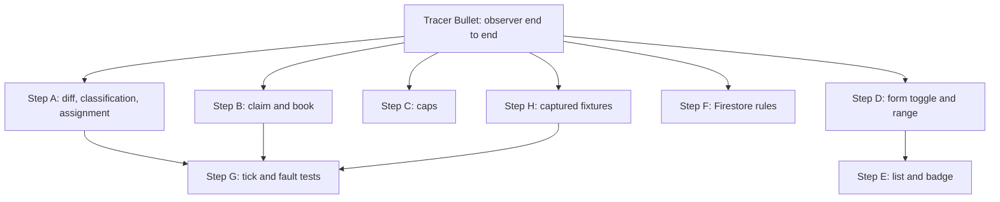

# Cancellation Watch

## Problem

resbot can only book at a known moment: a snipe fires at the venue's drop time (or polls a window around it in discovery mode) and then stops. Once a date sells out, the user has no way to get a table except checking Resy by hand. At hot venues, tables that people cancel come back into inventory at random times, and the diners who get them are the ones polling when it happens.

Resy offers no push, webhook or websocket for third parties. Its own Notify feature (`POST /3/notify`) alerts everyone on the list at once by email or push, so it cannot beat a poller and is out of scope. Every competitor we found (TablePass, open-source bots) detects cancellations by polling availability.

---

## Goal

A user can watch a venue, date, party size and a range of acceptable times, such as 5pm to 9pm. resbot polls Resy once a minute and books the first opening inside that range, with the user's own Resy account, without the user doing anything else.

We also collect data on how often tables open, at which venues and how far ahead, so we can decide whether to invest in faster polling.

---

## Non-Goals

- Resy Notify, email parsing or push handling of any kind.
- Date ranges or multiple dates per watch. One watch is one date, like a snipe.
- Sub-minute polling. The tick is once a minute; faster tiers come later if the data justifies them.
- Maximizing how many users one burst of openings serves. Assignment is first come, first served (see Matching).
- Tock, OpenTable or any other platform.

---

## Requirements

- A watch is created from the existing reservation form with a "Watch for cancellations" toggle. In watch mode the form asks for an earliest and latest acceptable time instead of a target time and window, and hides the drop schedule fields.
- A watch books only a slot whose start time falls inside its range, inclusive at both ends, and matches its seating type if one is set.
- Polling never uses a user's Resy token. It sends the app API key with an empty auth token, and it must not fall back to `RESY_TOKEN` from the environment, which may hold the owner's token.
- Polls are shared: one calendar call per `(venueId, partySize)` per tick, however many users watch it.
- When several watches match the same opening, the one created first gets it. A user never gets two slots from one watch.
- A watch books as soon as a poll shows a matching slot, including one that was already open when the watch was created.
- A booking for a given watch happens at most once, even if two ticks overlap.
- A watch ends when it books, when the user cancels it, when the latest time in its range passes, or when its Resy session expires.
- Every detected opening is logged, whether or not anyone booked it.
- Caps: at most 25 active `(venueId, partySize)` targets across all users, and at most 5 active watches per user. Both are constants.
- No ticks run during quiet hours, 2am to 7am Eastern by default.
- A 429 from Resy on a target backs that target off; it does not stop the whole tick.
- Booking can be switched off with a flag, leaving the observer running.
- The worst-case monthly compute bill is bounded by configuration, not by hoping ticks stay fast (see Cost).

---

## Approach (high level)

### How detection works

Resy's `/4/venue/calendar` returns one status per date (`available` or `sold-out`) for a whole booking window in a single call, and it answers without a user token. It cannot see a cancellation on a date that already has some other open slot, because the date is `available` either way. So the calendar only decides which dates need a closer look:

1. For each target `(venueId, partySize)`, call `/4/venue/calendar` once.
2. Dates that are `sold-out` need nothing more this tick.
3. For each watched date that is `available`, call `/4/find` for that date and party size.
4. Compare the returned slots with the snapshot from the last tick. New slot keys are openings and are written to `watchEvents`.
5. Assign current slots to watches (see Matching) and book the assignments.

Booking uses the current slots, not only the new ones, so a watch created on a date that already has a matching slot gets it on the next tick.

### Snapshot storage

Each target's state lives on one doc, `watchTargets/{venueId}_{partySize}`, as a plain map from date to a sorted list of slot keys, for example `{"2026-09-26": ["19:30|Dining Room", "21:15|Bar"]}`. A slot key is the start time plus the seating type (`config.type`). Diffing is a set difference of two lists, and the doc stays small: a few dates with a few dozen keys each, far under Firestore's 1 MiB doc limit. The same doc holds the last calendar result, `lastPolledAt` and `backoffUntil`.

We keep this off the `venues/{venueId}` doc for two reasons. Any signed-in client may write `venues` because it doubles as the frontend venue cache, so a client could corrupt poll state. And a write every minute would churn a doc the frontend reads.

### Matching

Each tick, for every watched date with slots, we assign slots to watches first come, first served:

1. Sort the date's active watches by `createdAt`, oldest first.
2. For each watch in order, pick the earliest slot inside its range and seating type that no earlier watch took, and assign it.
3. Watches with nothing left stay pending.

This is greedy assignment of points (slots) to intervals (time ranges) in arrival order. A maximum bipartite matching could serve more users when one burst opens several slots, but it would sometimes give an older watch's slot to a newer one. We chose the rule users can predict. Within a range we pick the earliest slot, since the user said any time in the range is fine.

The booking call is told which slot it was assigned. It does its own `/4/find` with the user's token, books the slot with that key through `ResyManager._try_book_slot`, and fails fast if the slot is gone. It does not let `SimpleSelector` pick, because two users' selectors could both pick the same slot.

### Known gap: signed-out polling does not see all inventory

During implementation we compared the same calendar signed in and signed out, at the same moment. For I Sodi, signed out showed 0 available dates out of 14, while signed in showed 9. For The Commerce Inn, signed out showed 10 available dates, so signed-out polling works in general. The likely cause is inventory gated to some accounts, such as American Express Global Dining Access tables; `/4/find` slots carry `is_global_dining_access` and `exclusive.is_eligible` fields. That is inference, not confirmed.

The consequence: this observer sees only inventory that any signed-out visitor can book. Openings that only some accounts can see are missed. The alternative is to poll with a dedicated resbot Resy account, which sees more and risks only that account, never a user's. Deciding that is left to after the observer week, when `watchEvents` will show whether signed-out polling catches enough.

Update after the first production run: the decision came sooner. Three minutes after the tick started, Resy began answering every signed-out `/4/venue/calendar` call from Cloud Run with a 500. The same call from a home connection returned 200, and a signed-in call from Cloud Run returned 200. So polls now sign in as a dedicated resbot Resy account (`RESY_POLL_EMAIL` and `RESY_POLL_PASSWORD` in Secret Manager). It is never a user's account and never the owner's personal one, so a ban costs only that account. The session is cached per instance and replaced only when Resy rejects it, and a failed sign-in waits 10 minutes before trying again, so a bad password is not retried every minute. This replaces the "no user token" requirement: polls still never use a watcher's token, and booking still uses only the watcher's own account.

### Cancellation or release

The watch books either one, since a new slot on a watched date is what the user wants. The distinction only matters for the hit-rate data, so each `watchEvents` entry records whether it happened within a few minutes of the venue's known drop time, using `venues/{venueId}.dropTimeDiscovery` that discovery mode already writes. Openings outside that window count as cancellations.

### Scheduling: a self-chaining task at a fixed second

Cloud Scheduler cron has minute granularity, so any job it runs fires near second :00. So do most bots and cron jobs: a lot of pollers look at Resy in the first few seconds of each minute. A poll at second :50 sees any table cancelled between their :00 poll and our :50 poll about 10 seconds before they do. Against pollers aligned to :00, polling at :50 wins roughly the openings that land in the first 50 seconds of each minute. It gains nothing against a bot polling every second, and the alignment of other pollers is our assumption, not measured.

To hit a chosen second we use Cloud Tasks, which schedules to the second:

- `watchtick` is a `tasks_fn.on_task_dispatched` function. It has no underscores because Firebase names its Cloud Tasks queue after it, and queue IDs allow only letters, digits and hyphens. Its first action is to enqueue the next tick at its own scheduled time plus 60 seconds, with task ID `watch-tick-{YYYYMMDDHHMM}` for the minute of that next time. Computing from the scheduled time rather than the clock matters: a tick scheduled for 4:00:50 that cold-starts and begins at 4:01:02 must queue 4:01:50, not skip to 4:02:50. The first tick after a seed runs at second `WATCH_TICK_SECOND` (default 50). Only then does it poll. Enqueueing first means a crash mid-poll does not break the chain.
- Cloud Tasks rejects a duplicate task ID for about an hour, so the deterministic ID makes enqueueing idempotent: two ticks or a tick plus the watchdog can never fork into two chains.
- `seed_watch_tick` is an `on_schedule("every 5 minutes")` watchdog that enqueues the next tick with the same deterministic ID. If the chain is alive, this is a rejected duplicate and costs one operation. If the chain died (a deploy, a failed enqueue), it restarts within 5 minutes.
- During quiet hours the tick does not enqueue a successor, and the watchdog does not seed. The first watchdog run after 7am restarts the chain.

The offset sets when Cloud Tasks dispatches the tick, not when the poll reaches Resy. A warm instance polls within about a second of dispatch; a cold start adds its startup time, and a 10-second cold start moves that tick's poll to :00, where it has no edge. Cold starts should be rare with a tick every minute, so we measure before designing around them: every tick logs the gap between scheduled and actual start and the second at which the first calendar call leaves. If the observer week shows frequent cold starts, dispatch at :40 and sleep until :50 before polling; the sleep is billed but stays inside the free tier, and the 55-second timeout keeps the ceiling in Cost unchanged.

This replaces the plain `on_schedule("every 1 minutes")` tick from the first draft. The watchdog is still declared in code and deployed by CI, so nothing is created at runtime. It remains a second scheduling pattern next to the runtime `CloudSchedulerClient` jobs in `schedule.py`, for the same reason: snipes are one-shot jobs per user action, and the tick is a fixed singleton.

### Cost

Firebase Python functions run on Cloud Run with request-based billing by default. Under it, Google bills CPU and memory only while an instance is starting, handling a request, or shutting down, rounded up to 100 ms ([Cloud Run pricing](https://cloud.google.com/run/pricing), [billing settings](https://docs.cloud.google.com/run/docs/configuring/billing-settings)). Once the tick returns, billing stops. An idle instance kept around for reuse costs nothing unless min instances are set, and we set none. So the bill is a function of total time spent starting and running ticks, which is what the model below uses.

Rates in us-central1, from the same page: $0.000024 per vCPU-second and $0.0000025 per GiB-second of active time, after a monthly free tier of 180,000 vCPU-seconds, 360,000 GiB-seconds and 2M requests. The free tier is per billing account and shared with the other functions, including snipes.

Ticks per month: 60 an hour for 19 hours a day (quiet hours off) over 30 days is 34.2k ticks. The tick runs at 256 MiB, which gives it 0.167 vCPU; polling is waiting on the network, not computing.

| Scenario | Billed seconds per tick | vCPU-seconds | GiB-seconds | Monthly compute cost |
| --- | --- | --- | --- | --- |
| Warm, normal tick | 5 | 28,557 | 42,750 | $0 (inside free tier) |
| Cold start plus backoff every tick | 30 | 171,342 | 256,500 | $0 (inside free tier) |
| Ceiling: every tick runs the full minute, 24 hours a day | 60 | 432,864 | 648,000 | $6.79 |

The ceiling row is what bounds the bill. The tick has a 55-second timeout and `max_instances=1`, so at most one tick bills at a time and none runs past 55 seconds. Even if every tick hung for its full timeout around the clock, compute stays under $7 a month.

Cold starts cost less than they seem to. With a tick every minute the instance is almost always warm, because Cloud Run keeps idle instances for reuse for a while at no charge. Cold starts happen mainly after deploys, and on the first tick after quiet hours.

Other services:

| Service | Monthly usage | Free tier | Monthly cost |
| --- | --- | --- | --- |
| Cloud Tasks | ~43,200 operations (ticks plus watchdog seeds) | 1,000,000 operations ([Cloud Tasks pricing](https://cloud.google.com/tasks/pricing)) | $0 |
| Cloud Scheduler | 1 watchdog job | 3 jobs per billing account, then $0.10 per job ([Cloud Scheduler pricing](https://cloud.google.com/scheduler/pricing)) | up to $0.10 |
| Firestore reads | ~75 per tick at the caps (active watches plus target docs), ~2.6M | 50,000 per day ([Firestore pricing](https://firebase.google.com/docs/firestore/pricing)) | under $1 (rate not confirmed) |
| Firestore writes | only when a snapshot changes or an opening is logged | 20,000 per day | ~$0 |

Snipes already create one Cloud Scheduler job each, so the three free Scheduler jobs may already be used, which is why the watchdog is priced at $0.10. The Firestore read rate per 100k for our region did not load from the pricing page and has to be checked before rollout. At a few cents per 100k reads the total stays under $1.

Two guards back up the model: a Google Cloud budget alert at $10 a month on the project, and the per-tick duration log from Layer 4 of Testing. The one-week observer run gives the real numbers.

### Data model

- `reservationJobs/{jobId}` holds the watch, with `watchMode: true`. It reuses `venueId`, `partySize`, `date`, `seatingType`, `status`, `errorMessage`, `executionLogs` and `resyToken`, and adds `rangeStart` and `rangeEnd` as `"HH:MM"` strings. `hour` and `minute` are set to the range start so existing list code still has a time to show. Drop fields are empty. Status stays `pending` while watching, so the reservations page, edit and cancel work as they do today. Booking claims a watch by setting `bookingClaimedAt` in a transaction, not by changing status, since the UI maps unknown statuses to Failed.
- `watchTargets/{venueId}_{partySize}` (new, server-only) holds shared poll state, as described under Snapshot storage.
- `watchEvents/{autoId}` (new, server-only) records each opening: target, date, slot key, detected time, whether it fell inside the release window, and which watch it was assigned to, if any. With booking off, the assignment is the shadow-mode record of what would have booked.

The alternative was a separate `watches` collection. We rejected it because a watch has the same fields as a snipe apart from the drop time and range, and a new collection would mean a second list, edit and cancel path in the UI.

### Booking

Booking reuses the snipe path in `snipe.py`: `_build_reservation_request_from_dict` builds the request and manager from the user's `resyCredentials`. The watch then books its assigned slot as described under Matching, with the same short deadline and error handling as `_execute_booking_with_deadline`.

- Success: `_finalize_job` sets `done` and `resyToken`, as a snipe does.
- Slot gone or taken: clear the claim and keep watching.
- Auth expired: `_handle_auth_expiry` ends the watch with the reconnect message.
- Repeated non-transient failures, for example a payment method the venue rejects: after 3 attempts the watch ends as `failed` with the last error, so it does not retry every minute forever.

### Ownership

- `functions/api/watch.py` owns the tick and the watchdog: chaining, quiet hours, loading watches, grouping targets, polling, snapshots, events and expiry.
- `functions/api/watch_match.py` owns pure logic with no I/O: slot keys, snapshot diffs, the release-window flag and first-come assignment.
- `functions/api/watch_booking.py` owns claiming and booking an assigned slot.
- `functions/api/watch_limits.py` owns caps, called by `create_snipe`.
- `schedule.py` accepts `watchMode`, `rangeStart` and `rangeEnd` on create and update, skips Cloud Scheduler for watches, and skips deleting a scheduler job when cancelling one.
- Frontend: the reservation feature owns the toggle and range inputs; the reservations feature owns showing a watch in the list.

### File structure plan

```text
functions/
├── main.py                                   (modified)  export watchtick, seed_watch_tick
├── scripts/capture_resy_fixtures.py          (new)       refresh fixtures from live Resy
└── api/
    ├── constants.py                          (modified)  WATCH_* caps, tick second, quiet hours, flag
    ├── resy_client/http_client.py            (modified)  opt-in cap on retry waits, used by the poller
    ├── schedule.py                           (modified)  watchMode and range on create/update/cancel
    ├── watch.py                              (new)       task-chained tick and watchdog
    ├── watch_match.py                        (new)       pure diff, classification, assignment
    ├── watch_booking.py                      (new)       claim and book an assigned slot
    ├── watch_limits.py                       (new)       per-user and global caps
    └── tests/
        ├── fixtures/resy/                    (new)       captured calendar and find payloads
        ├── test_watch_match.py               (new)
        ├── test_watch_booking.py             (new)
        ├── test_watch_limits.py              (new)
        ├── test_watch_tick.py                (new)
        ├── test_watch_create.py              (new)
        └── watch_fakes.py                    (new)       in-memory Firestore for the tests

firestore.rules                               (modified)  deny client access to watchTargets, watchEvents

src/
├── services/firebase.ts                      (modified)  watchMode and range on request and ReservationJob types
├── lib/api.ts                                (modified)  range fields on the update call
├── components/ui/unified-search-controls.tsx (modified)  showTime prop so watch mode can hide the time picker
├── features/reservation/
│   ├── atoms/reservationFormAtom.ts          (modified)  watch toggle and range state
│   ├── api/useScheduleReservation.ts         (modified)  send one watch request, no drop schedules
│   └── components/ReservationForm.tsx        (modified)  toggle, range inputs, hide drop fields
└── features/reservations/
    ├── lib/types.ts                          (modified)  watchMode and range on UI type
    ├── api/useReservationsData.ts            (modified)  map watch jobs
    └── components/ReservationsDataTable.tsx  (modified)  "Watching" badge, range instead of drop time
```

---

## Testing

No test double will match Resy one to one: sessions expire, transient failures come in real patterns, bot protection reacts to load, and response shapes drift without notice. So no single layer is trusted on its own. Each layer below catches a class of failure the one before it cannot see, and the layers that touch real Resy run in production rather than in CI.

### Layer 1: unit tests on our own logic (CI)

`watch_match`, `watch_limits` and the claim state machine in `watch_booking` are tested against plain data and fakes. These tests say why a rule exists: a watch created on a date with a matching slot books on the next tick; the older of two overlapping watches gets the single opening; a slot one minute outside the range is never booked; two overlapping ticks never book twice. They catch mistakes in our decisions and nothing about Resy.

### Layer 2: tick tests on real captured payloads (CI)

The tick is tested through `responses`, which the resy_client tests already use, serving JSON captured from real Resy responses rather than hand-written bodies. The fixtures cover a sold-out calendar, a partly available calendar, `/4/find` with and without slots, and real error bodies for 429, 419 and 500. A small script, `functions/scripts/capture_resy_fixtures.py`, refreshes them from live Resy with auth headers stripped. This catches parsing and grouping bugs against real shapes. It does not catch drift after capture; Layer 4 does.

We chose captured JSON with `responses` over vcrpy cassettes because it needs no new dependency and matches the existing test style. Cassettes are worth revisiting if fixture refreshes become frequent.

### Layer 3: fault injection on the retry and backoff paths (CI)

Using the ordered registry in `responses`, tests replay failure sequences we have seen from Resy: 500, 500, 200; a connection reset; a 429 on one target while others succeed; a 419 in the middle of a booking. They check that one target's failure never stops the tick, that a 429 sets `backoffUntil`, and that an auth failure ends only that user's watch. Failures below HTTP, such as slow drips and resets mid-body, are out of scope for now; Toxiproxy covers them if they show up in production.

### Layer 4: the observer is the live contract test (production)

Every tick calls `/4/venue/calendar` and `/4/find` on real Resy, so the observer checks the read endpoints against reality every minute, without the separate daily contract suite the usual advice calls for. For that to work it has to fail loudly:

- The resy_client models already use `extra='allow'`, so a new field never breaks polling, and a missing or retyped field raises `ResyApiError`, which goes to Sentry with the response body.
- The watchdog is wrapped in a Sentry cron monitor, which alerts when it misses a run or fails. The tick reports its own failures to Sentry.
- Each tick logs counts and timings: targets polled, finds made, openings seen, responses by status, billed duration, and the gap between scheduled and actual start. A rise in 429 or 403 responses is the early sign of rate limiting or a bot block, before polls fail outright. So is a run of ticks with zero successful polls.

### Layer 5: shadow mode before booking (production)

With the booking flag off, the tick still runs matching, and each assignment is written to `watchEvents` as the booking that would have happened. A week of shadow data shows whether matching is right on real inventory, how many openings a one-minute tick catches, and what the ticks really cost, before anything touches a user's account.

### Layer 6: one supervised live booking (production, manual)

Shadow mode never calls the book endpoint. The book path itself is the one snipes already use in production, so the new risk is in the claim and in booking an assigned slot. Before turning booking on for everyone, we run one watch on our own account at a low-demand venue with no deposit or cancellation fee, confirm it books once, and cancel the reservation in Resy.

### What we are not doing

We are not building a Resy sandbox or a live contract suite in CI. A sandbox would encode our assumptions about Resy rather than its behavior. And a CI suite hitting Resy would fail the build on Resy's outages, while adding load under the same IPs the observer uses.

---

## Done When

- [ ] A watch created from the form with a time range shows as Watching on the reservations page.
- [ ] The tick chain runs at the configured second, restarts through the watchdog after a break, and pauses during quiet hours.
- [ ] The tick polls each target once, logs openings to `watchEvents`, and books assigned slots when booking is enabled.
- [ ] No poll request carries a user token.
- [ ] Only slots inside a watch's range are booked, and the oldest matching watch gets a contested slot.
- [ ] A watch books at most once under overlapping ticks.
- [ ] Watches end on booking, cancel, range end, auth expiry and repeated failure.
- [ ] Caps are enforced in `create_snipe` with a clear error.
- [ ] Tests from the Testing section pass; pylint stays at 9.5+.
- [ ] A $10 monthly budget alert exists on the project.
- [ ] The observer ran in production for a week with booking off, and the measured cost matches the model, before booking was turned on.

---

## Implementation Steps

Build the tracer bullet first, alone. It is the observer end to end: a watch job exists, the task chain runs, the tick polls Resy for real, and a snapshot lands in Firestore. It creates the new modules with minimal bodies so every later step owns a file that already exists. After it is green, the remaining steps are file-disjoint and run in parallel.



### Tracer Bullet: observer end to end

**Depends on**: nothing (runs first, blocks all steps)
**Scope**: `functions/api/watch.py`, `functions/main.py`, `functions/api/constants.py`, `functions/api/schedule.py`, and stub versions of `functions/api/watch_match.py` (set difference of slot keys, assignment returns nothing), `functions/api/watch_booking.py` (no-op while the flag is off) and `functions/api/watch_limits.py` (always allows).
**Verify**: `create_snipe` with `watchMode: true` and a range writes a pending job and creates no scheduler job. Running the tick handler once locally against the Firestore emulator with real Resy calls writes a `watchTargets` doc with calendar and slot snapshots, enqueues the next tick for second 50 with the deterministic ID, and the logged request headers show an empty auth token. A second enqueue with the same ID is rejected as a duplicate. The watchdog carries its Sentry cron monitor, and the tick logs per-tick counts and timings from the start, since the observer doubles as the live contract test. pylint passes on the new files.

### Step A: diff, classification, assignment

**Depends on**: Tracer Bullet
**Scope**: `functions/api/watch_match.py`, `functions/api/tests/test_watch_match.py`
**Verify**: unit tests cover first-seen dates (baseline, no events), new and removed slots, seating-type keys, the release-window flag on both sides of the boundary, range edges (inclusive start and end, one minute outside), and first-come assignment when watches compete for one slot and for several.

### Step B: claim and book

**Depends on**: Tracer Bullet
**Scope**: `functions/api/watch_booking.py`, `functions/api/tests/test_watch_booking.py`
**Verify**: tests show one claim wins under two concurrent attempts, the assigned slot key is the one booked, success finalizes as `done`, a vanished slot clears the claim, auth expiry ends the watch, and the third non-transient failure ends it as `failed`.

### Step C: caps

**Depends on**: Tracer Bullet
**Scope**: `functions/api/watch_limits.py`, `functions/api/tests/test_watch_limits.py`
**Verify**: tests reject the sixth watch for a user and a new target past 25, and allow a new watch on an existing target at the cap.

### Step D: form toggle and range

**Depends on**: Tracer Bullet
**Scope**: `src/features/reservation/components/ReservationForm.tsx`, `src/features/reservation/atoms/reservationFormAtom.ts`, `src/features/reservation/api/useScheduleReservation.ts`, `src/services/firebase.ts`
**Verify**: turning the toggle on swaps the time and window fields for earliest and latest time, hides the drop fields, rejects a range whose end is before its start, and submits one request with `watchMode: true`; the emulator path writes the same doc shape. `npm run lint` and `tsc` pass. Sentry spans wrap the submit, as for snipes.

### Step E: list and badge

**Depends on**: Step D (uses the `watchMode` and range fields on `ReservationJob`)
**Scope**: `src/features/reservations/lib/types.ts`, `src/features/reservations/api/useReservationsData.ts`, `src/features/reservations/components/ReservationsDataTable.tsx`
**Verify**: a pending watch shows a Watching badge and its time range instead of a drop time; edit and cancel work; a booked watch moves to Succeeded.

### Step F: Firestore rules

**Depends on**: Tracer Bullet
**Scope**: `firestore.rules`
**Verify**: the emulator denies client reads and writes to `watchTargets` and `watchEvents`; existing rules unchanged.

### Step H: captured fixtures

**Depends on**: Tracer Bullet
**Scope**: `functions/scripts/capture_resy_fixtures.py`, `functions/api/tests/fixtures/resy/`
**Verify**: the script writes calendar and find fixtures from live Resy for a sold-out and a partly available venue; no fixture contains an auth token or API key.

### Step G: tick and fault tests

**Depends on**: Step A, Step B, Step H
**Scope**: `functions/api/tests/test_watch_tick.py`
**Verify**: on captured fixtures served by `responses`, a tick groups two users on one target into one calendar call, skips sold-out dates, expires watches past their range end, skips its successor during quiet hours, and computes its successor from its scheduled time, so a late start never skips a minute. Under fault sequences it backs off a target on 429 without failing others, survives 500s and resets, and ends only the affected watch on 419.

---

## Resources

- [Resy Notify help](https://helpdesk.resy.com/what-is-notify-and-how-does-it-work-BJrJzPQLu): why Notify cannot beat a poller.
- [monad-droid/reservations](https://github.com/monad-droid/reservations): open-source bot that polls for cancellations.
- [Inc: Resy deactivated a user over 200 requests an hour](https://www.inc.com/victoria-salves/resy-deactivated-user-after-automated-assistant-made-200-requests-an-hour/91402131): why polls never use a user token.
- [Resy platform security](https://resy.com/join/platform-security/): Cequence bot protection.
- [Cloud Run pricing](https://cloud.google.com/run/pricing) and [billing settings](https://docs.cloud.google.com/run/docs/configuring/billing-settings): request-based billing, rates and free tier.
- [Cloud Tasks pricing](https://cloud.google.com/tasks/pricing), [Cloud Scheduler pricing](https://cloud.google.com/scheduler/pricing), [Firestore pricing](https://firebase.google.com/docs/firestore/pricing).
- [Fowler: ContractTest](https://martinfowler.com/bliki/ContractTest.html) and [IntegrationTest](https://martinfowler.com/bliki/IntegrationTest.html): testing against services you do not control.
- [Zyte: Spidermon](https://www.zyte.com/blog/spidermon-scrapy-spider-monitoring/): production validation for scrapers.
- [Sentry Python crons](https://docs.sentry.io/platforms/python/crons/): cron monitor for the watchdog.
- [responses](https://github.com/getsentry/responses): ordered registry for fault sequences.
